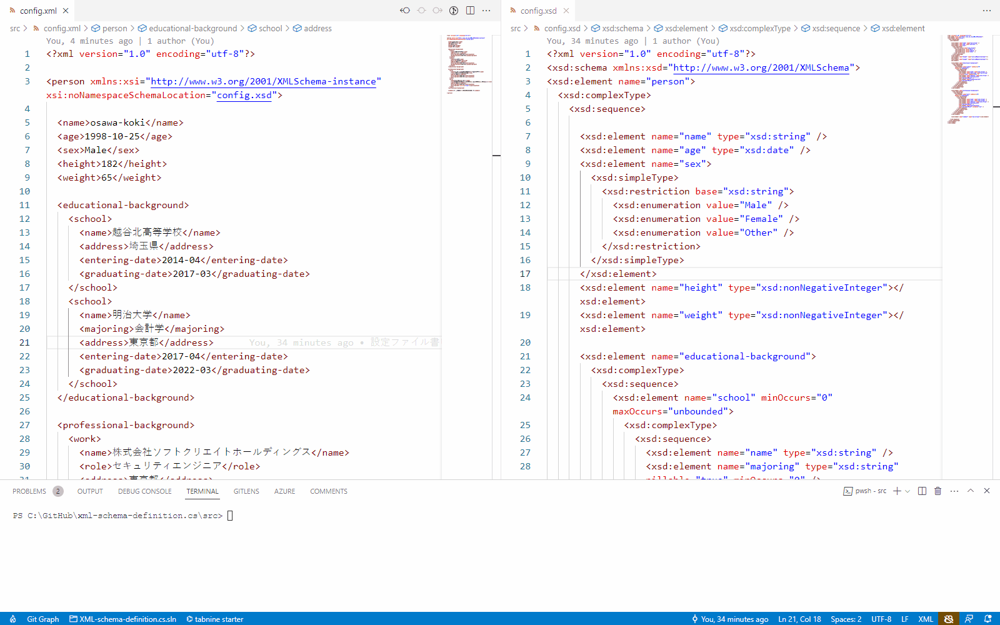

# XML-schema-definition.cs

XMLスキーマ定義の検証をC#で行うためのサンプルプロジェクト。  

  

## 参考文献

- [東京電機大学 XML Schemaによるスキーマ記述](https://www.mlab.im.dendai.ac.jp/~yamada/web/xml/xmlschema.html)
- [IBM XSDデータ型](https://www.ibm.com/docs/ja/jfsm/1.1.2.1?topic=queries-xsd-data-types)
- [Web tutorials XMLスキーマ](http://memopad.bitter.jp/w3c/schema/el_element.html)
